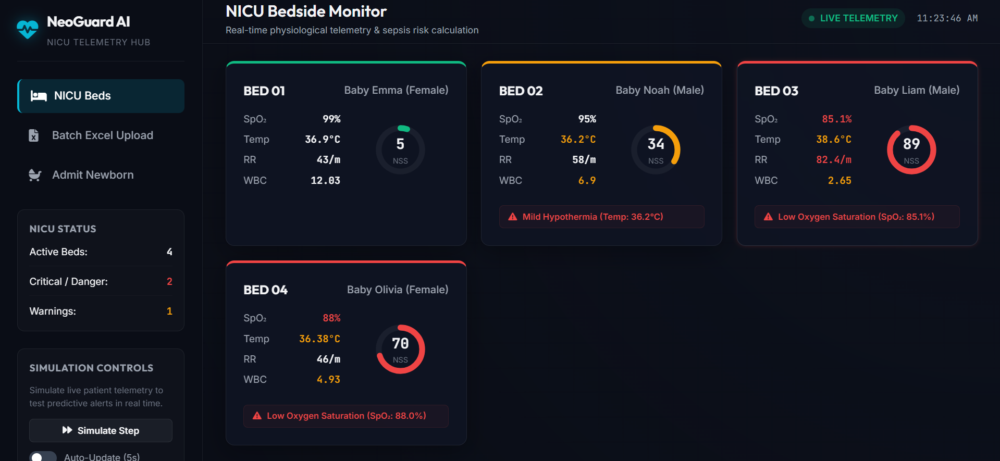

# NeoGuard AI: Neonatal Sepsis Prediction & NICU Telemetry Dashboard

## Project Aim
The primary aim of this project is to provide a predictive tool for the early detection of **Neonatal Sepsis**, a severe medical condition in newborns caused by an infection in the bloodstream. Early detection is critical for the survival and treatment of infants in Neonatal Intensive Care Units (NICUs).

This application provides a real-time bedside clinical telemetry dashboard where medical professionals can monitor vital signs, calculate composite sepsis scores, and run bulk or individual predictions using an optimized machine learning model.

---

## Features

### 1. Optimized Machine Learning Model
At the core of the prediction pipeline is a **Random Forest Classifier** optimized using `GridSearchCV` hyperparameter tuning to ensure robust, non-linear relationships across 8 key physiological and clinical features:
- **Heart Rate (BPM)**
- **SpO2 (%)** (Oxygen saturation)
- **Temperature (°C)**
- **Respiratory Rate (/min)**
- **CRP (mg/L)** (C-reactive protein, a marker of inflammation)
- **WBC (10^9/L)** (White blood cell count)
- **Gestational Age (weeks)**
- **Birth Weight (g)**

### 2. Clinical Risk Scores & Indices
In addition to machine learning probabilities, the platform calculates advanced physiological indices:
- **TVI (Temperature Variability Index)**: Tracks thermal instability over trailing readings.
- **HSI (HRV Sepsis Index)**: Measures heart rate characteristics and variability decels.
- **OIS (Oxygen Instability Score)**: Evaluates the frequency and depth of oxygen desaturations.
- **PRS (Prematurity Risk Score)**: Integrates Gestational Age classifications and Birth Weight groups to establish baseline vulnerability.
- **NSS (Composite NeoSepsis Score)**: A clinical score weighted as:
  - HRV: 25%
  - SpO2 Variability: 15%
  - Temperature Instability: 15%
  - CRP Trend: 15%
  - WBC: 10%
  - Gestational Age: 10%
  - Birth Weight: 10%

### 3. Real-Time Alert Thresholds
- **SpO2 Status**: `CRITICAL_LOW` (<85%), `LOW` (<90%), `TARGET` (90-95%), `HIGH` (>95%). Covers hyperoxia in preterm babies (>98%).
- **Temperature**: Tracks severe hypothermia (<36.0°C), mild hypothermia (<36.5°C), elevated temp (37.6-38.0°C), and fever (>38.0°C). Triggers a **Temperature Instability Alert** if `delta_temp_6h > 0.8°C`.
- **Respiratory Rate**: Normal (30-60/min), mild tachypnea (61-70/min), and severe tachypnea/apnea alerts.
- **CRP Trend Alert**: Triggers a `CRP Trend ↑↑` warning for rapid rise over trailing hours.
- **WBC**: Leukopenia warnings (`WBC < 5`) and leukocytosis warnings (`WBC > 40`).

### 4. Interactive NICU Beds Telemetry Grid
- Initializes with 3 default patient beds (Emma, Noah, and Liam).
- Supports admitting newborns manually via the **Admit Newborn** form, adding new beds dynamically to the monitoring dashboard.
- Includes a live telemetry simulator tool to walk patients through physiological fluctuations and test alerts in real time.

---

## Setup and Installation

1. **Install Dependencies:**
   Ensure you have Python installed, then run:
   ```bash
   pip install -r requirements.txt
   ```

2. **Train the Optimized Model:**
   To perform hyperparameter grid search and generate the model artifacts (`model.pkl`, `imputer.pkl`, `feature_names.pkl`), run:
   ```bash
   python train.py
   ```

3. **Run the Web Application:**
   Start the Flask web server by running:
   ```bash
   python app.py
   ```
   The application will be accessible locally at `http://localhost:5000`.

---

## Output Preview



